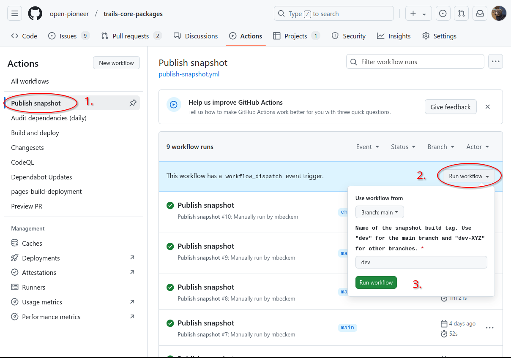
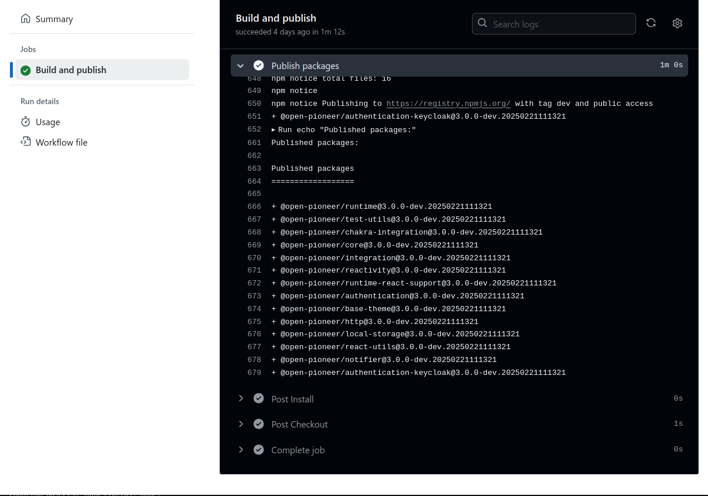
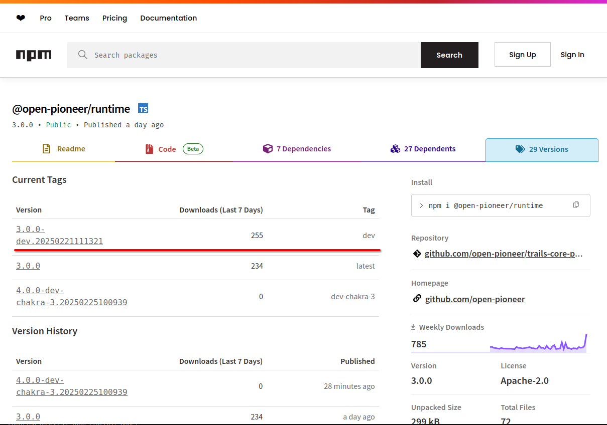

# Publishing Snapshots

Snapshots are pre-releases that may be used during development.
We publish our snapshots with versions that look like this: `@open-pioneer/runtime@3.0.0-dev.20250221111321`.

- `dev` is the pre-release ("snapshot") tag
- `20250221111321` is the timestamp at the time of publishing

See also [SemVer item 9](https://semver.org/#spec-item-9).

## How to publish a snapshot

The "Publish Snapshot" Github Workflow is prepared in all relevant repositories (see [example for core-packages](https://github.com/open-pioneer/trails-core-packages/actions/workflows/publish-snapshot.yml)).

To publish snapshots, follow these steps:

- Navigate to the "Publish Snapshot" Workflow.
- Click on "Run workflow".
- Select target branch (e.g. "main") and snapshot tag (e.g. "dev").
  The packages of the branch will be built and published with the selected tag.

### Notes:

- **DO NOT** publish with tag **latest**.
  This must only be done using the release workflow (changesets).
- Use **dev** tag for main branch (the default) or **dev-XYZ** (e.g. dev-chakra-3) for other branches.
- Snapshots are released with the same tag/timestamp.
- Currently the target branch needs at least one changeset file.

### Examples

#### Triggering the workflow



#### Workflow run

The workflow's log shows the published packages and their versions:



#### Package on npm

npmjs.com shows the tag and its new version:



## Cleanup

- Individual package versions do not need to be cleaned up.
- Obsolete tags (e.g. **dev-my-feature**) can be removed manually when they are no longer being used:

    ```bash
    # Note: requires permissions on the npm repository
    TAG_TO_REMOVE="dev-my-feature"
    for PKG in $(pnpm list -r --json --depth -1 --filter "@open-pioneer/*" | jq -r '.[].name'); do
        npm dist-tag rm "$PKG" "$TAG_TO_REMOVE";
    done
    ```
