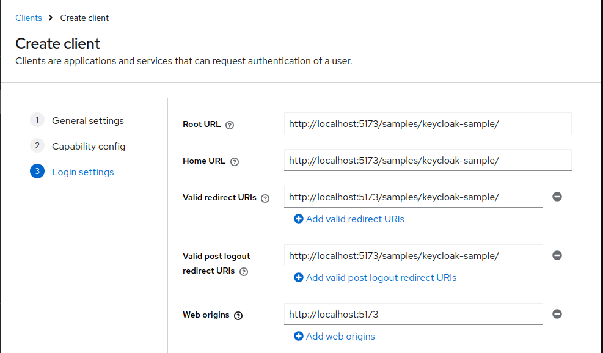

# keycloak-sample

Testing keycloak locally with docker.

## Docker container

Create a local docker container, for example by using the following command:

```bash
# Note: --rm will automatically delete your container when it exits
$ docker run --rm -it -p 8080:8080 -e KEYCLOAK_ADMIN=admin -e KEYCLOAK_ADMIN_PASSWORD=admin quay.io/keycloak/keycloak:latest start-dev
```

## Creating a client application

Open <http://localhost:8080> and log in with `admin` / `admin`.

Visit the "Clients" section of the admin console and click "Create client":


Authentication can be left to default settings:


Configure the URLs of your local application.
We're using the path to the keycloak sample app in the following example.

Note that the Vite server must run on the exact port used here (you can change the vite config to force a specific port, if necessary).



Finally, save the new client configuration.

## Configuring the sample app

Create a file called `.env.local` in the root of this repository with the following content:

```
VITE_KEYCLOAK_CONFIG_URL=http://localhost:8080
VITE_KEYCLOAK_CONFIG_REALM=master
VITE_KEYCLOAK_CONFIG_CLIENT_ID=trails
```

Afterwards, restart vite and open the keycloak sample app in your browser.
It should now redirect to you to your local keycloak and back to the sample app once you are authenticated.


Clicking the "Logout" button should end the session.
